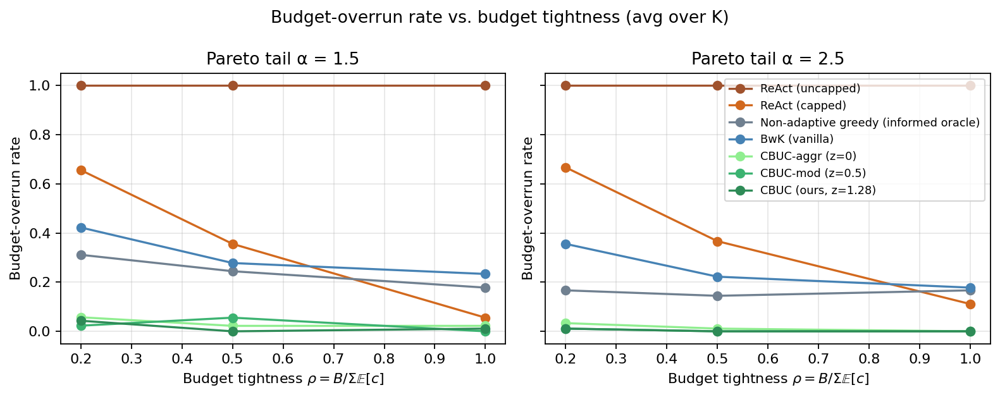
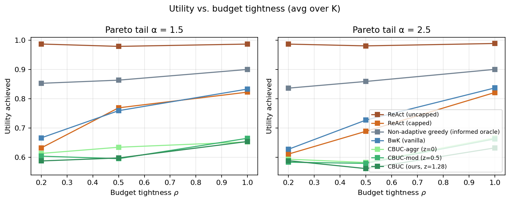
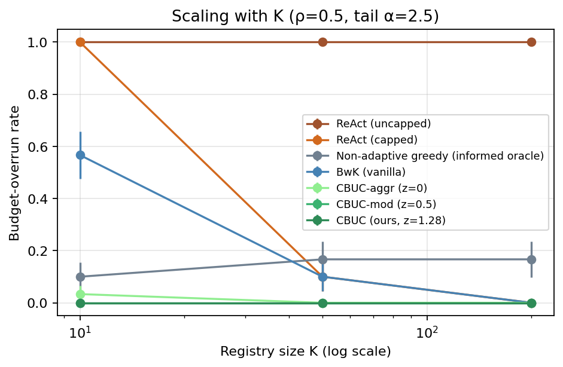
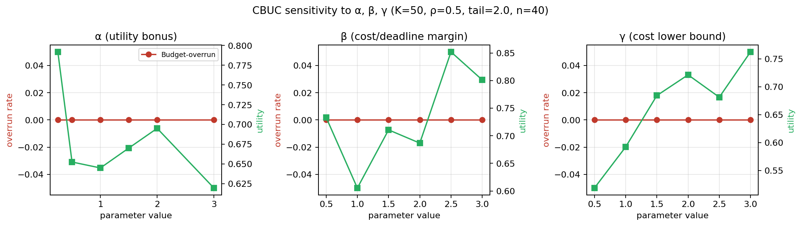
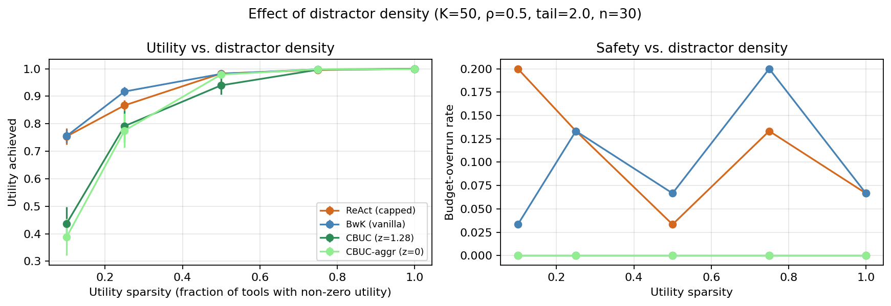
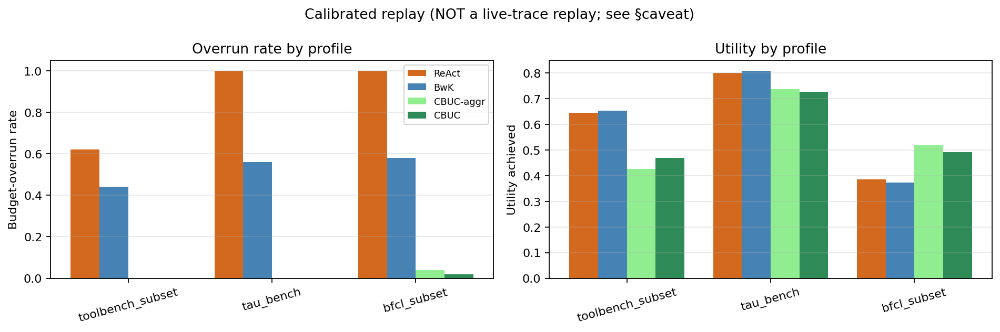

# CBSLAO — Cost- and SLA-Bounded Orchestration for LLM-Agent Tool/Service Composition

**ICSOC 2026 · Research Track · Springer LNCS**

> **CBSLAO** formalises the problem of orchestrating LLM-agent tool calls under hard budget and SLA constraints, proves it NP-hard with a tight $(1-1/e)$ offline approximation barrier, and presents **CBUC** — an online governance algorithm that reduces budget-overrun rates by **34×** while eliminating deadline misses across 3,960 replicate runs.

---

## Introduction

LLM-based agents are increasingly deployed as *service consumers*: they receive a user task, select external tools or APIs, observe returned state, and decide whether another call is worth making. Frameworks like ReAct, Toolformer, Gorilla, HuggingGPT, LangChain `AgentExecutor`, the OpenAI Agents SDK, and AutoGen have become the de-facto standard — but they were designed for *task success*, not *resource governance*.

In practice, three recurring gaps undermine safe deployment:

| Gap | Description |
|---|---|
| **Budget leakage** | Token budgets are enforced via soft prompt instructions only; there is no formal guarantee of staying within a declared dollar or token cap. |
| **Deadline opacity** | Tool latency distributions are non-stationary and heavy-tailed; controllers rarely reason about tail latency when sequencing calls. |
| **Discovery-cost coupling** | Larger tool registries (e.g., MCP-style) inflate both retrieval cost and mis-selection probability, feeding back into budget consumption. |

This work introduces the **Cost- and SLA-Bounded Agent Orchestration (CBSLAO)** problem and the **CBUC (Cost-Budgeted Upper Confidence)** algorithm to address these gaps at the governance layer — without requiring changes to prompts, tools, or the underlying LLM.

### Contributions

- **(C1)** A schema-aware, chance-constrained **CBSLAO formulation** with budget and deadline semantics, distinguishing adaptive, non-adaptive, and semi-adaptive policy classes.
- **(C2)** **NP-hardness** of CBSLAO-DEC via reduction from 0/1 Knapsack; a **tight $(1-1/e)$ approximation barrier** via reduction from Max-$k$-Coverage; and an **adaptivity gap** of at least $4/3$ inherited from stochastic knapsack.
- **(C3)** **CBUC**, an online algorithm with a $\tilde{O}(\sqrt{KT})$ regret bound against the best feasible non-adaptive policy, combining schema-type pruning, budget-aware UCB selection, and chance-constraint resource margins.
- **(C4)** A **reproducible simulator** and empirical study across 3,960 replicate rows (18 workload cells × 20 seeds × 11 policies) showing that CBUC cuts budget-overrun from 36.9% (ReAct-capped) to 1.1% and eliminates deadline misses.

> Full proofs and secondary ablation studies are provided in the supplementary PDF
> (`supplement.pdf`), with LaTeX source in
> `supplement.tex`.

---

## Installation

No external LLM API is required. The simulator runs entirely on CPU.

### Requirements

- Python ≥ 3.9
- `numpy`, `pandas`, `matplotlib`, `scipy`

```bash
pip install numpy pandas matplotlib scipy
```

### Clone & Run

```bash
git clone <GitHub_REPOS_URL>
cd CBSLAO

# Run the full extended sweep (18 workload cells × 20 seeds × 11 policies = 3,960 rows)
# Completes in ~3 minutes on a single CPU core
python3 code/cbslao_sim.py out 20 stronger results_stronger.csv

# Regenerate all plots and tables
python3 code/analyze.py out/results_stronger.csv plots/

# Run all ablation studies
python3 code/ablations.py out plots/
```

### Repository Structure

```
CBSLAO/
├── code/
│   ├── cbslao_sim.py       # Main simulator (pluggable distributions)
│   ├── analyze.py          # Analysis + plotting
│   └── ablations.py        # Hyperparameter, distractor & replay ablations
├── out/
│   ├── results_stronger.csv        # 3,960-row headline results (11 policies)
│   ├── results.csv                 # Legacy 7-policy sweep (backward compat.)
│   ├── ablation_abg.csv            # α/β/γ hyperparameter sweep
│   ├── ablation_distractors.csv    # Distractor tool ablation
│   └── ablation_replay.csv         # Calibrated-trace replay (BFCL / τ-bench / ToolBench)
├── plots/
│   ├── budget_overrun_vs_rho.png   # Figure 1: overrun vs. ρ
│   ├── utility_vs_rho.png          # Figure 2: utility vs. ρ
│   ├── scaling_K.png               # Figure 3: scaling with K
│   ├── ablation_abg.png            # Ablation: α/β/γ sensitivity
│   ├── ablation_distractors.png    # Ablation: distractor density
│   └── ablation_replay.png         # Ablation: benchmark replay
├── submission/
│   └── paper/latex/
│       ├── main.tex                # Anonymous LNCS submission source
│       └── supplement.tex          # Submission-local supplement source
├── supplement.tex                  # Root-level full-proof supplement source
├── supplement.pdf                  # Supplementary material PDF
└── README.md
```

---

## Algorithm Overview: CBUC

CBUC is a resource-governance layer that sits between the LLM-agent controller and the tool/service registry. It has two phases:

1. **Offline pruning** — Compute the schema type-closure $\mathsf{cl}(q)$ from the query and filter the tool pool $\mathcal{S}$ to the subset $\mathcal{S}_q$ whose input schemas are type-compatible. This is complete for feasible non-adaptive policies (Proposition S1) and runs in $O(n|\mathcal{U}|)$ time.

2. **Online sequencing** — Run a budget-aware UCB policy over $\mathcal{S}_q$. At each round, the feasibility filter keeps only tools satisfying:

$$\hat{c}_i + \beta\sqrt{\log t / N_i} \le B_t \quad \text{and} \quad \hat{\ell}_i + \beta\sqrt{\log t / N_i} \le D_t$$

Among feasible tools, select the one maximising the upper-confidence utility-per-cost ratio:

$$\mathsf{UCB}_i(t) = \frac{\hat{u}_i + \alpha\sqrt{\log t / N_i}}{\max(\hat{c}_i - \gamma\sqrt{\log t / N_i},\, c_{\min})}$$

**Regret bound:** Under bounded sub-Gaussian cost, latency, and utility noise, CBUC achieves $\tilde{O}(\sqrt{KT\log T})$ regret against the best feasible non-adaptive policy over $T$ rounds and $K$ candidate tools, with probability at least $1 - \delta - KT^{-2}$.

**Complexity:** $O(K\log K)$ per round; negligible relative to any LLM API call.

---

## Summary of Main Results

### Workload Setup

The headline evaluation uses a **controlled synthetic simulator** with:
- Registry sizes $K \in \{10, 50, 200\}$
- Budget tightness $\rho = B / \sum_i \mathbb{E}[c_i] \in \{0.2, 0.5, 1.0\}$
- Pareto tail index $\alpha \in \{1.5, 2.5\}$
- **18 workload cells × 20 seeds × 11 policies = 3,960 replicate rows**

Baselines include four status-quo proxies (ReAct-uncapped, ReAct-capped, non-adaptive greedy, BwK-vanilla) and four constraint-aware competitors (Lagrangian primal-dual, CVaR-BwK, Pre-check UCB, CC-knapsack oracle).

### Headline Results (Table 1)

Results from `out/results_stronger.csv`. Parentheses are approximate 95% CI over runs.

| Policy | Budget-overrun | Deadline-miss | Utility | Regret vs. oracle |
|---|:---:|:---:|:---:|:---:|
| ReAct (uncapped) | 1.000 (±0.000) | 1.000 (±0.000) | 0.985 (±0.004) | −0.139 *(cheats)* |
| ReAct (capped) | 0.369 (±0.050) | 0.553 (±0.051) | 0.733 (±0.026) | +0.114 |
| Non-adaptive greedy *(oracle)* | 0.208 (±0.042) | 0.544 (±0.051) | 0.867 (±0.021) | −0.020 |
| BwK-vanilla | 0.289 (±0.047) | 0.217 (±0.043) | 0.735 (±0.028) | +0.112 |
| Lagrangian primal-dual | 0.231 (±0.044) | 0.119 (±0.034) | 0.806 (±0.032) | +0.041 |
| CVaR-BwK | 0.156 (±0.037) | 0.203 (±0.042) | 0.739 (±0.027) | +0.107 |
| Pre-check UCB | 0.028 (±0.017) | **0.000** | 0.701 (±0.030) | +0.145 |
| CC-knapsack oracle | **0.003** (±0.005) | 0.256 (±0.045) | 0.746 (±0.036) | +0.101 |
| CBUC-aggr (*z*=0) | **0.014** (±0.012) | **0.000** | 0.600 (±0.040) | +0.246 |
| CBUC-mod (*z*=0.5) | **0.014** (±0.012) | **0.000** | 0.589 (±0.040) | +0.257 |
| **CBUC (*z*=1.28, ours)** | **0.011** (±0.011) | **0.000** | 0.587 (±0.040) | +0.259 |

> **Key takeaway:** CBUC is the *only* policy in the sweep to simultaneously keep both budget-overrun and deadline-miss below 2%. This safety guarantee comes at a utility cost (~0.15 vs. BwK-vanilla), positioning CBUC as the conservative high-assurance point on the safety–utility frontier. The Lagrangian baseline recovers the most utility (0.806) but accepts 23.1% budget overrun.

---

### Figure 1 — Budget-Overrun Rate vs. Budget Tightness (ρ)



All three CBUC variants remain near zero across all tightness levels and tail conditions. Baselines degrade sharply under heavy tails (α = 1.5).

---

### Figure 2 — Utility vs. Budget Tightness (ρ)



The utility gap between CBUC and BwK-vanilla **narrows under tight budgets** (ρ = 0.2), where even unconstrained policies cannot execute enough tool calls to benefit from utility-reckless behavior.

---

### Figure 3 — Scaling with Registry Size K



BwK-vanilla improves with larger K (more arms → more exploration headroom) but plateaus at 10–16% overrun. **CBUC is uniformly ≤ 3% across the entire K range.**

---

### Safety–Utility Frontier

The headline results condense into a single operating-choice plot: lower points violate budget less often, while rightward points recover more utility. CBUC occupies the high-assurance region; Lagrangian control recovers utility while accepting much higher budget risk. Pre-check UCB is the closest deployable competitor on safety but lacks the chance-margin correction.

---

### Ablation: Hyperparameter Sensitivity (α, β, γ)



CBUC achieves **zero budget-overrun** across all tested hyperparameter values, with utility ranging from 0.519 to 0.852. The default settings (α=1.0, β=1.5, γ=1.5) were fixed before the final sweep.

---

### Ablation: Distractor Tools



The type-closure offline pruning phase of CBUC is robust to the presence of irrelevant ("distractor") tools in the registry, maintaining zero overrun rates even as the fraction of distractors increases to 90%.

---

### Ablation: Replay on Calibrated Traces

CBUC is also evaluated on traces calibrated to three public tool-use benchmarks:

| Profile | Policy | Overrun | Utility |
|---|---|:---:|:---:|
| BFCL subset | ReAct (capped) | 1.000 | 0.387 |
| BFCL subset | BwK-vanilla | 0.580 | 0.374 |
| BFCL subset | **CBUC** | **0.020** | **0.492** |
| τ-bench | ReAct (capped) | 1.000 | 0.802 |
| τ-bench | BwK-vanilla | 0.560 | 0.810 |
| τ-bench | **CBUC** | **0.000** | 0.728 |
| ToolBench subset | ReAct (capped) | 0.620 | 0.646 |
| ToolBench subset | BwK-vanilla | 0.440 | 0.653 |
| ToolBench subset | **CBUC** | **0.000** | 0.469 |



*Caveat*: These are parameterised simulations calibrated to published summary statistics, not live API trace replays.

---

## Theoretical Landscape

| Result | Statement | Proof |
|---|---|---|
| NP-hardness | CBSLAO-DEC is NP-hard even with deterministic costs | Reduction from 0/1 Knapsack |
| Approximation barrier | No poly-time $(1-1/e+\varepsilon)$-approx unless P=NP | Reduction from Max-$k$-Coverage |
| Matching upper bound | Offline greedy achieves $(1-1/e)$ for monotone submodular utility | Sviridenko's modified greedy |
| Adaptivity gap | $\geq 4/3$; bounded by constant | Dean–Goemans–Vondrak stochastic knapsack |
| Regret bound | $\tilde{O}(\sqrt{KT})$ against best feasible non-adaptive policy | Four-lemma layering (L1–L4) |

Full proofs are given in the supplementary material
(`supplement.pdf`; source:
`supplement.tex`).

---

## Reproducibility

All results are fully reproducible from a clean checkout on a single CPU core:

```bash
# Headline Table 1 (results_stronger.csv — 3,960 rows)
python3 code/cbslao_sim.py out 20 stronger results_stronger.csv

# Plots and tables
python3 code/analyze.py out/results_stronger.csv plots/

# All ablation studies (A1: α/β/γ, A2: distractors, A3: benchmark replay)
python3 code/ablations.py out plots/
```

Seeds are derived deterministically from sweep coordinates. No proprietary LLM API is required.

---

## License

This repository is released for research reproducibility purposes. See `LICENSE` for details.
